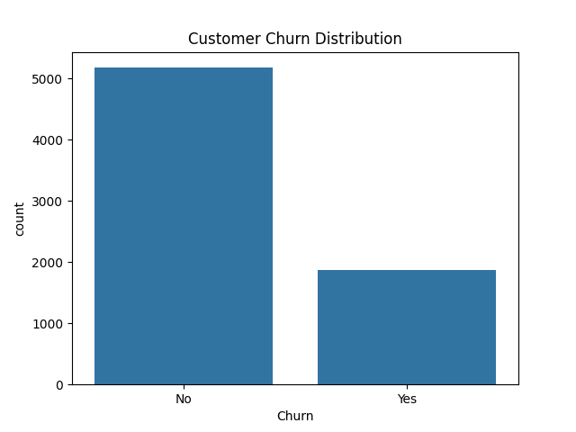
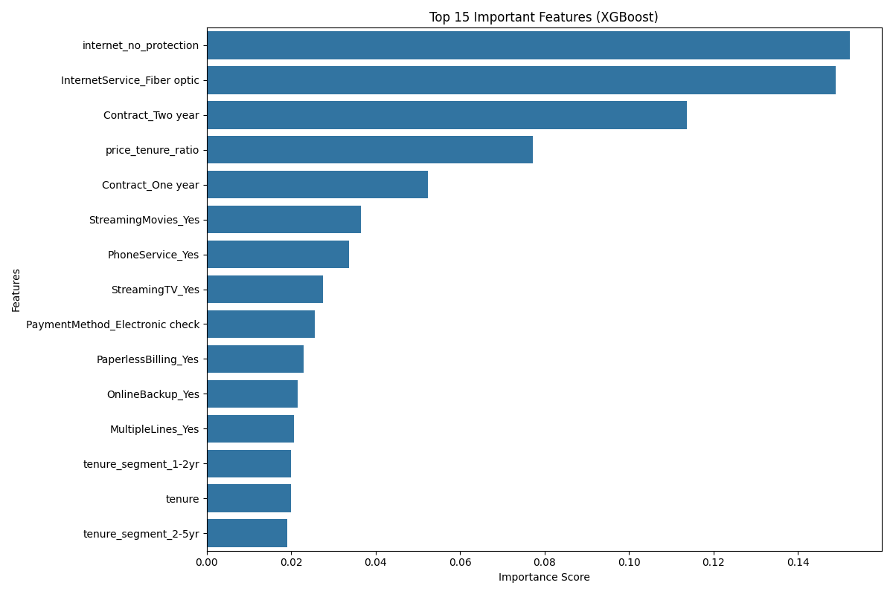

# 📊 Customer Churn Prediction – Telecom

🚀 End-to-end machine learning project to predict customer churn and drive business retention strategies.

---

## 🎯 Project Overview
This project builds a machine learning model to identify customers at risk of churn in a telecom company.  
The goal is to enable proactive retention strategies and reduce customer loss.

---

## 📊 Business Problem

- Telecom company loses ~25% customers annually  
- Customer acquisition cost is **5× higher** than retention  
- Goal: Predict churn early and take preventive actions  

---

## 🗂️ Dataset

📥 **Download Dataset:**  
👉 [IBM Telco Customer Churn Dataset](https://www.kaggle.com/datasets/blastchar/telco-customer-churn) 

- 7,043 customers  
- 21 features  

---

## ⚙️ Project Workflow

- Data Cleaning  
- Exploratory Data Analysis (EDA)  
- Feature Engineering  
- Model Building (XGBoost)  
- Model Evaluation  

---

# 📷 Model Output

---

## 🔹 Customer Churn Distribution

---

## 🔹 Feature Importance (Top Drivers of Churn)

---

## 🤖 Model Used

- ✅ XGBoost Classifier  
- Handles non-linear relationships  
- Effective for structured/tabular data  
- Handles class imbalance  

---

## 📊 Model Performance

- **Accuracy:** 80.5%

### Classification Report:

| Class | Precision | Recall | F1 Score |
|------|----------|--------|----------|
| 0 (Non-churn) | 0.84 | 0.90 | 0.87 |
| 1 (Churn)     | 0.66 | 0.54 | 0.59 |

---

## ⚠️ Model Observation

- Model performs well for **non-churn customers**
- Recall for churn prediction is lower (**54%**)

👉 This means the model misses some customers who are actually at risk of leaving.

---

## 🔧 Scope for Improvement

- Improve recall using:
  - SMOTE (oversampling)
  - Hyperparameter tuning
  - Threshold optimization  

---

## 🔍 Key Insights

- Customers with **month-to-month contracts** churn more  
- Customers with **high monthly charges** are high risk  
- **New customers (low tenure)** are more likely to churn  
- Customers without **security services** tend to leave  

---

## 💡 Business Recommendations

- Offer retention plans to high-risk customers  
- Encourage long-term contracts  
- Improve onboarding for new customers  
- Bundle value-added services  

---

## 🛠️ Skills Demonstrated

- Data Cleaning & Preprocessing  
- Feature Engineering  
- Machine Learning (XGBoost)  
- Model Evaluation  
- Data Visualization  
- Business Problem Solving  

---

## ⚙️ Tech Stack

- Python  
- Pandas  
- NumPy  
- Scikit-learn  
- XGBoost  
- Matplotlib / Seaborn  

---
